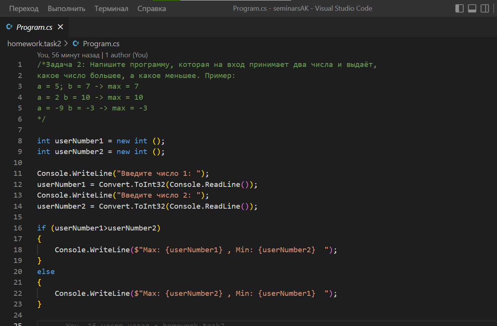

# Домашняя работа к семинару №2 #
## ***Задача 10*** ##
Напишите программу, которая принимает на вход трёхзначное число и на выходе 
показывает вторую цифру этого числа. 

Пример:

456 -> 5

782 -> 8

918 -> 1

## ***Задача 13*** ## 
Напишите программу, которая выводит третью цифру заданного числа или сообщает, 
что третьей цифры нет. 

Пример:

645 -> 5

78 -> третьей цифры нет

32679 -> 6

## ***Задача 15*** ## 

# Домашняя работа к семинару №1 #

## ***Задача 2*** ## 
Напишите программу, которая на вход принимает два числа и выдаёт, какое число большее, а какое меньшее.

Пример:

a = 5, b = 7 -> max = 7

a = 2, b = 10 -> max = 10

a = -9, b = -3 -> max = -3

## ***Задача 4*** ## 
Напишите программу, которая принимает на вход три числа и выдаёт максимальное из этих чисел.

Пример:

2, 3, 7 -> 7

44, 5, 78 -> 78

22, 3, 9 -> 22

## ***Задача 6*** ## 
Напишите программу, которая на вход принимает число и выдаёт, является ли число чётным 
(делится ли оно на два без остатка). 

Пример:

4 -> да

-3 -> нет

7 -> нет

## ***Задача 8*** ## 
Напишите программу, которая на вход принимает число (N), а на выходе показывает все 
чётные числа от 1 до N.

Пример:

5 -> 2, 4

8 -> 2, 4, 6, 8

